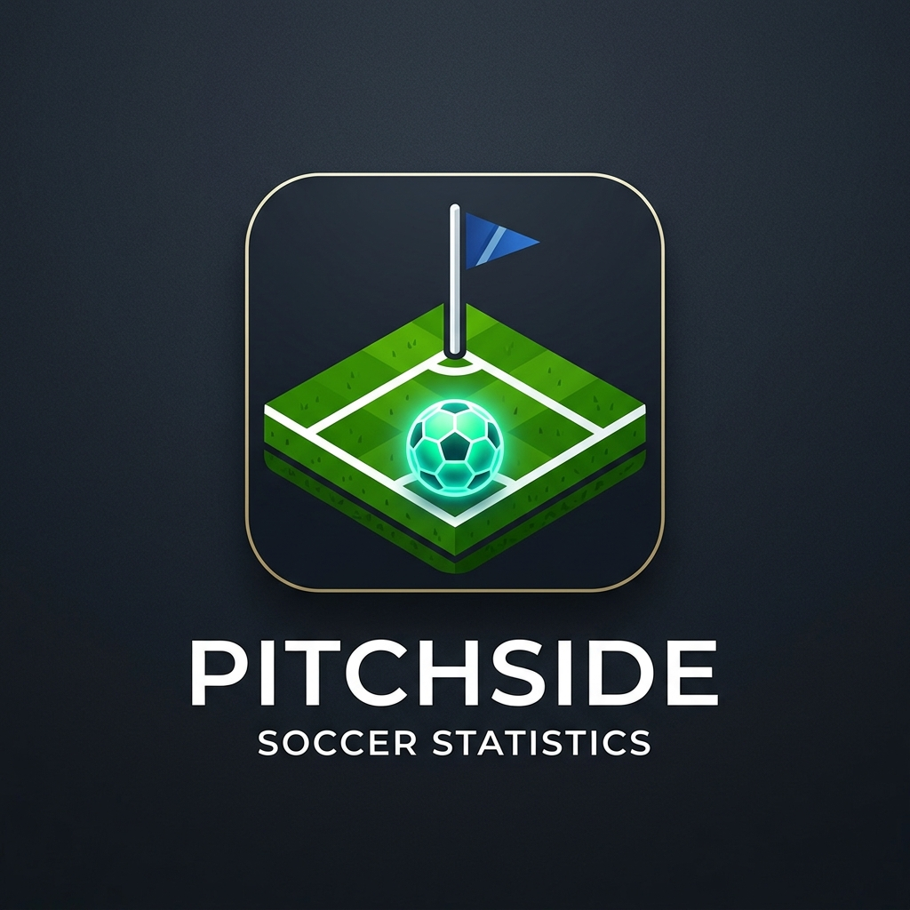

# ⚽ PitchSide

<p align="center">
  
</p>

<p align="center">
  <strong>Premium Football Standings, Live Knockout Brackets & Player Statistics Tracker</strong>
</p>

<p align="center">
  <a href="https://flutter.dev"></a>
  <a href="https://pub.dev/packages/flutter_bloc"></a>
  <a href="https://github.com/DISCONECTED-png/Api_pl_table_bloc_flutter/releases"></a>
</p>

---

## 🌟 Overview

**PitchSide** is a state-of-the-art, premium soccer/football companion app built with Flutter and BLoC state management. It provides soccer enthusiasts with real-time league tables, interactive cup group standings, dynamic knockout bracket trees, and comprehensive top player performance statistics (Goals, Assists, Cards) across all major European leagues and UEFA competitions.

Designed with **glassmorphism**, dynamic gradient theme transitions, and rich micro-animations, **PitchSide** delivers an immersive and visually stunning experience that brings the beautiful game right to your fingertips.

---

## ✨ Features

### 🛡️ Double-Carousel Competition Selector
*   **Domestic Leagues Carousel**: Seamlessly swipe through Premier League, La Liga, Serie A, Bundesliga, and Ligue 1.
*   **UEFA European Cups Carousel**: Interactive swipe deck for UEFA Champions League, Europa League, and Europa Conference League.
*   **Dynamic Theme Morphing**: The entire app background gradient, accent colors, glow effects, and icons dynamically morph in real-time as you swipe between different competitions.

### 📊 Dynamic Group Stages & Knockout Brackets (UEFA Cups)
*   **Multi-Tab Cup Navigation**: Cups dynamically expand to a 3-tab layout containing **Standings**, **Knockout Bracket**, and **Player Stats**.
*   **Dynamic Standings**: Real-time group standings parsed directly from the live `football-data.org` API.
*   **Interactive Squad Navigation**: Tap any team in the group standings to view their dynamic roster, manager info, and stadium details.
*   **Visual Brackets**: A gorgeous, side-scrolling visual knockout tree depicting round of 16, quarter-finals, semi-finals, and finals.

### 🏆 Custom Player Stats Leaderboards
*   **Live Scorers Integration**: Connects with live API scorers endpoints to fetch real-time leading goal scorers.
*   **Sub-Tab Swapping**: Quickly toggle between **Goals**, **Assists**, and **Yellow Cards** with micro-transition effects.
*   **Rank Podiums**: Premium gold, silver, and bronze visual rank badges awarded to the top 3 players in each category.

### 🛡️ Network Resilience & Fallback
*   **Live Status Indicator**: Floating status badges (🟢 `LIVE API DATA` vs 🟡 `OFFICIAL HISTORICAL DATA`) let you know the data origin.
*   **Graceful API Degradation**: Automatic error interceptors that seamlessly transition the app to a robust, premium mock database if the live API limits/permissions (`403` / `429`) are exceeded.
*   **Instant CDN Assets**: All team logos and tournament crests are powered by super-fast CDNs to completely eliminate loading issues.

---

## 🛠️ Tech Stack & Architecture

-   **Frontend Framework**: [Flutter](https://flutter.dev) (Dart)
-   **State Management**: [BLoC Pattern](https://pub.dev/packages/flutter_bloc) (Business Logic Component) for predictable state transitions
-   **API Integration**: [football-data.org](https://www.football-data.org) REST API
-   **Icons & Design System**: Material Design with tailored Glassmorphic containers and dynamic shadows
-   **Image Caching**: Global CDNs (ESPN & Wikipedia Commons) for lag-free crest rendering

---

## 🚀 Getting Started

### Prerequisites

*   Flutter SDK (v3.x or higher)
*   Dart SDK (v3.x or higher)
*   A `football-data.org` API token

### Installation

1.  **Clone the Repository**:
    ```bash
    git clone https://github.com/DISCONECTED-png/Api_pl_table_bloc_flutter.git
    cd Api_pl_table_bloc_flutter
    ```

2.  **Install Dependencies**:
    ```bash
    flutter pub get
    ```

3.  **Setup your API Key**:
    Add your auth token to the api calls inside `lib/api_service.dart`:
    ```dart
    static const String _token = 'YOUR_API_TOKEN';
    ```

4.  **Run the App**:
    ```bash
    flutter run
    ```

---

## 🎨 Branding & Theme Guidelines

PitchSide employs a strict aesthetic system:
*   **Primary Font**: Material Design native typography with robust weightings (`FontWeight.w900` for branding headers).
*   **Color Space**: Curated gradient pairs per competition (e.g., deep purples for UCL, dark blues/magentas for Premier League).
*   **Glassmorphism**: Visual cards utilize thin borders, 4-10% opacity white backgrounds, and slight drop shadows to achieve a floating glass appearance over the active gradient background.

---

## 📄 License

This project is licensed under the MIT License - see the [LICENSE](LICENSE) file for details.
